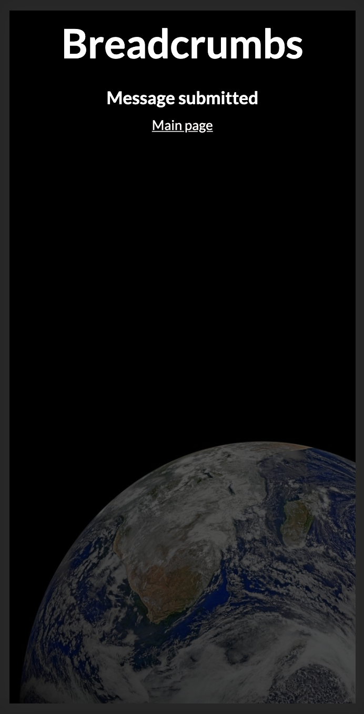

# Breadcrumbs

## What does it do?

[Breadcrumbs](http://ec2-54-237-51-191.compute-1.amazonaws.com) has a single purpose - to find and leave "breadcrumbs" a.k.a. messages. Optimized for mobile it uses a phone's GPS to look for any messages left within approximately 1 square mile encompassing the user, or to leave a message with a slightly randomized location to avoid being able to trace a message to a specific address. 

Similar to leaving actual breadcrumbs to find your way, you can also leave a trail of "breadcrumbs" to point a friend along an unknown path, or just leave one at a cool location on a hike or in the city.

Future planned functionality includes having password protected messages and giving the user options about how close someone needs to be to see the "breadcrumb".

The app is currently running in a Docker container on an EC2 instance and was written with the Go framework [Gin](https://github.com/gin-gonic/gin).

## Where to check it out

Breadcrumbs can currently be found at [Breadcrumbs](http://ec2-54-237-51-191.compute-1.amazonaws.com)

## Motivation

For my day job I often build microservices in Go that are hosted on Heroku. As a challenge I wanted to expand my knowledge and build a basic full stack app in Go with [Gin](https://github.com/gin-gonic/gin) to learn more about how Gin handles HTML templates, CSS/Javascript files, and different types of requests I don't normally see in API's.

I wanted to only use vanilla javascript with no external CSS (minus a reset CSS stylesheet). Due to this the full index  page is extremely lightweight and comes in at a nice 30 kB of code, 29 kB of fonts, and then a 224 kB image for a total of 282 kB.

I also wanted to familiarize myself more with Docker, containerizing apps, and hosting sites on AWS. That is why I decided to use Docker to run the app on an EC2 instance with an AWS Aurora database. 

## Screenshots

### Main page


### Leaving a breadcrumb




### Finding a breadcrumb


## Tech

* [Gin](https://github.com/gin-gonic/gin)
* [GORM](https://gorm.io/)
* [AWS EC2](https://aws.amazon.com/ec2/)
* [AWS Aurora](https://aws.amazon.com/rds/aurora/)

## Code examples

### Example of adding slight noise when leaving a breadcrumb (for privacy)

```go
func writeBreadcrumbToDB(message Message) {
	message.Lat = message.Lat + 0.005*(1-rand.Float64())
	message.Long = message.Long + 0.005*(1-rand.Float64())
	db.Create(&message)
}
```

### Example of router settings and routes

```go
func SetupRouterSettings() *gin.Engine {
	router := gin.New()
	router.Use(gin.Logger())
	router.Use(gin.Recovery())
	router.LoadHTMLGlob("templates/*")

	geo := router.Group("/")
	{
		geo.GET("", rootEndpoint)
		geo.POST("/submitbreadcrumb", submitBreadcrumb)
		geo.GET("/getbreadcrumbs", getBreadcrumbs)
	}
	router.Static("/web", "./web")
    router.NoRoute(endpointNotFound)
    return router
}
```

### Example of finding a message in the browser

```javascript
function findMessages(position) {
    removeLoading()
    var lat = position.coords.latitude
    var long = position.coords.longitude
    var url = "/getbreadcrumbs"
    var params = {
        lat: lat,
        long: long
    }
    axios.get(url, {params: params})
    .then(data=>{
        buildList(data)
    })
    .catch(err=>console.log(err))
}
```

## Getting started

First clone the repo in your favorite directory `git clone https://github.com/jpclark6/breadcrumbs.git`.

Copy the .env file and fill in with your own database credentials. `cp sample.env .env`

Run the app `go run main.go`

## Testing

Some basic tests have been added for this app that can be run using `go test`. 

## To-do/wishlist

The app has a basic, straight forward use so overall the simplicity is what makes it nice to use. I would like to add a few features that I listed above however.

* Let a user leave password protected "breadcrumbs" that someone would need to unlock the message

* Let a user decide how close someone needs to be from the "breadcrumb" to see that there is a message 

## Thanks for checking it out
